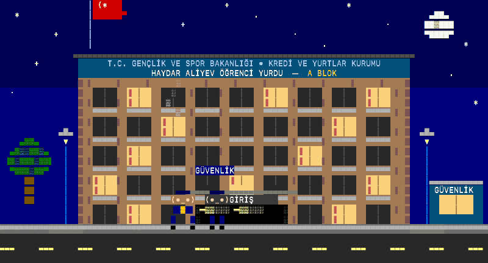

# Yurt Alarm



Yurt WhatsApp gruplarında **kendi bloğunla ilgili** önemli bir duyuru paylaşıldığında bilgisayarında sesli uyarı ve bildirim veren hafif bir masaüstü aracı. Telefon elinde değilken ya da sessizdeyken önemli mesajları kaçırmamak için.

- **Mesaj göndermez**, sadece okur.
- Windows ve Mac'te çalışır, terminalden ya da cmd'den tek komutla açılır.
- Hangi blokta kaldığını seçersin (A, B, C, D…). Sadece o blokla ilgili mesajlarda uyarı verir, gündelik konuşmalarda vermez.
- Hafiftir: çalışırken ~75 MB RAM kullanır, kurulumu ~31 MB tutar.
- Terminalde küçük bir piksel-art animasyon oynar (`--sade` ile kapatılabilir).

## Kurulum

1. **Node.js** kur (LTS sürümü): https://nodejs.org
2. Terminali (Mac) ya da cmd'yi (Windows) aç ve şunu yapıştır:

```bash
npx -y https://codeload.github.com/ardakie/HAYDAR-ALIYEVDE-NELER-OLUYOR/tar.gz/main
```

İlk açılışta:
1. Hangi blokta kaldığını sorar.
2. Bir QR kodu gösterir. Telefonda **WhatsApp > Ayarlar > Bağlı cihazlar > Cihaz bağla** deyip okut.
3. Bağlandıktan sonra adında **"Haydar Aliyev"** geçen grupları izlemeye başlar. Grup adını `--ayarla` ile değiştirebilirsin.

Sonraki açılışlarda aynı komut yeterli, QR tekrar istenmez.

> QR okunmuyorsa telefon numarasıyla eşleştirme kodu al:
> `npx -y https://codeload.github.com/ardakie/HAYDAR-ALIYEVDE-NELER-OLUYOR/tar.gz/main --kod 905XXXXXXXXX`

### İndirip çift tıklayarak
GitHub'da **Code > Download ZIP** ile indir ve klasörü aç:
- **Windows:** `Yurt-Alarm-Baslat.bat` dosyasına çift tıkla.
- **Mac:** `Yurt-Alarm-Baslat.command` dosyasına sağ tıkla > **Aç**.

## Kullanım

Çalışırken klavyeden:

| Tuş | Ne yapar |
|---|---|
| **A** | Uyarıyı aç / kapat (kapalıyken mesajlar yine ekranda görünür ama ses çalmaz) |
| **S** | Çalan sesi sustur |
| **D** | Deneme uyarısı |
| **G** | İzlenen grupları göster |
| **Q** | Çıkış |

Komutun sonuna eklenebilecek seçenekler:

```
--blok B        Bloğu değiştir
--ayarla        Blok ve izlenecek grup adlarını yeniden ayarla
--deneme        WhatsApp'a bağlanmadan uyarıyı dene
--animasyon     Sadece animasyonu izle
--sade          Animasyonsuz, düz yazı modu
--kod 905...    QR yerine telefon numarasıyla eşleştir
--cikis         WhatsApp oturumunu bu bilgisayardan sil
```

Animasyon için terminal penceresi en az **100×32** olmalı. Program pencereyi kendisi büyütmeye çalışır. Büyütemezse düz yazı modunda devam eder.

## Gizlilik

- Bilgisayarın WhatsApp'a **bağlı cihaz** olarak eklenir, tıpkı WhatsApp Web gibi. Telefonunda Ayarlar > Bağlı cihazlar'dan istediğin an kaldırabilirsin.
- Özel mesajlara bakılmaz, sadece adı eşleşen gruplar okunur. Hiçbir veri başka bir yere gönderilmez.
- Oturum ve ayarlar sadece senin bilgisayarında durur:
  - Mac: `~/.yurt-alarm`
  - Windows: `C:\Users\<adın>\.yurt-alarm`
- Program "çevrimiçi" görünmez ve okundu bilgisi göndermez. Telefonuna bildirimler gelmeye devam eder.
- Resmi bir WhatsApp uygulaması değildir. Açık kaynak [Baileys](https://github.com/WhiskeySockets/Baileys) kütüphanesini kullanır.
- Bilgisayar uyursa uyarı çalmaz. Mac'te program açıkken uyku otomatik engellenir. Windows'ta güç ayarlarından uykuyu kapat.

## Kaldırma

```bash
npx -y https://codeload.github.com/ardakie/HAYDAR-ALIYEVDE-NELER-OLUYOR/tar.gz/main --cikis
```

Sonra `.yurt-alarm` klasörünü silebilirsin. Telefonunda Bağlı cihazlar'dan da kaldır.

## Geliştirme

```bash
npm install
npm test
npm start
```

Lisans: MIT
